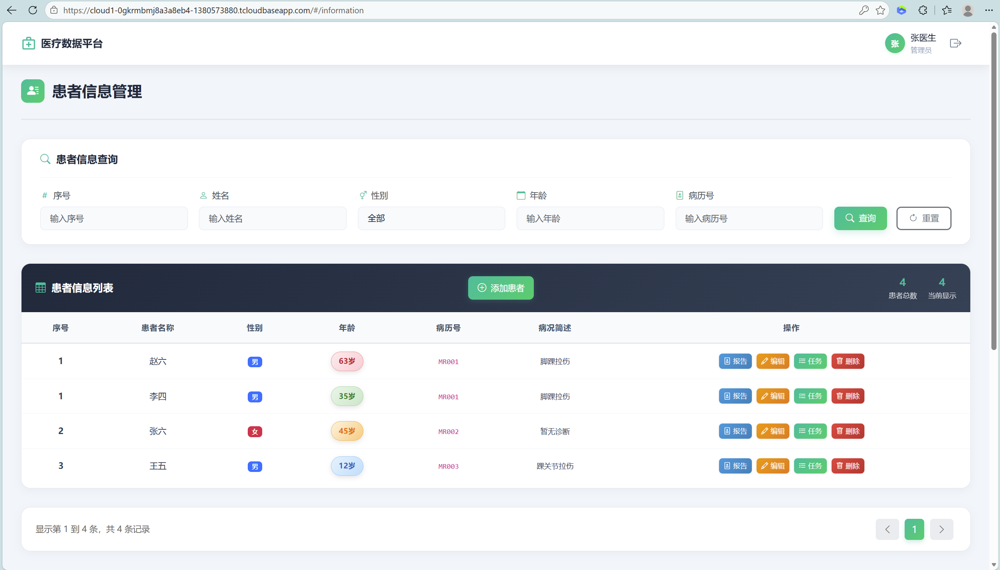
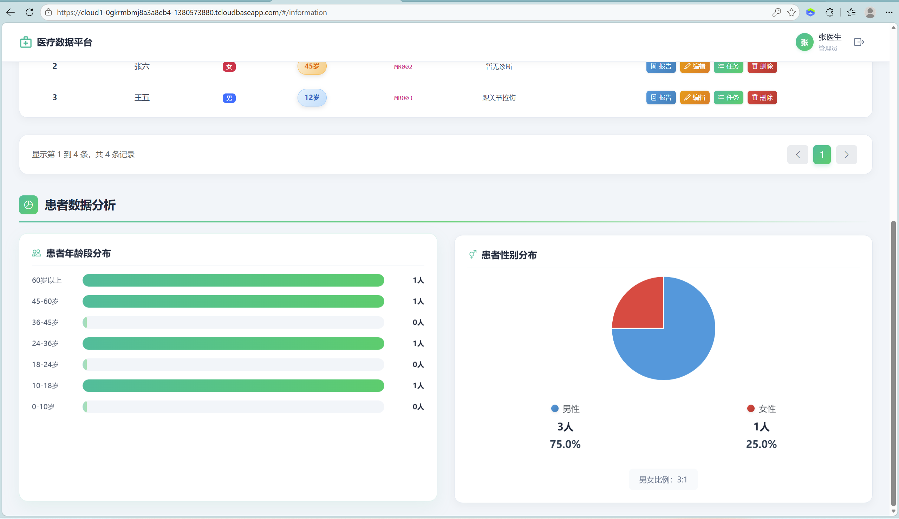
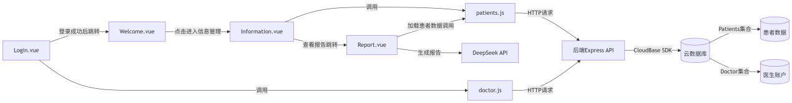
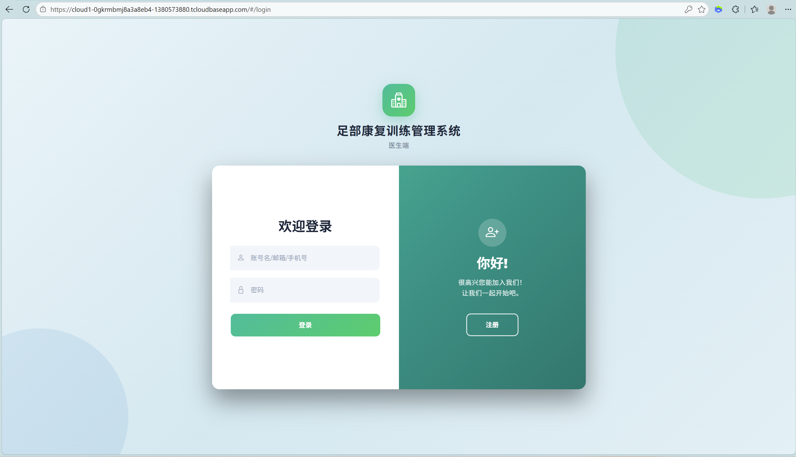
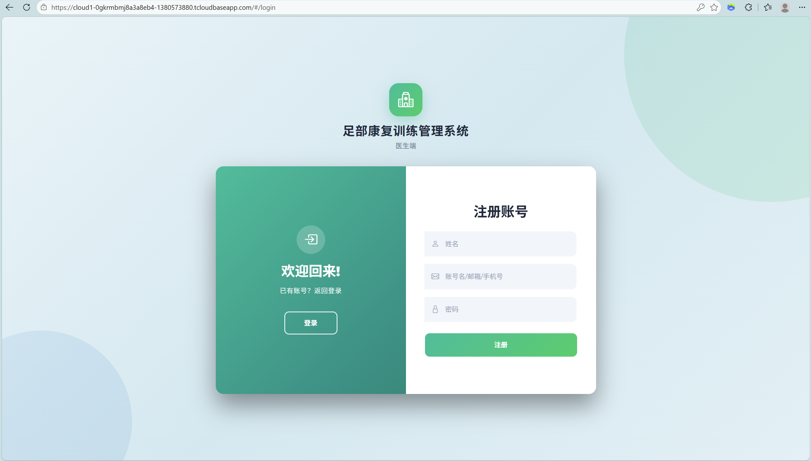
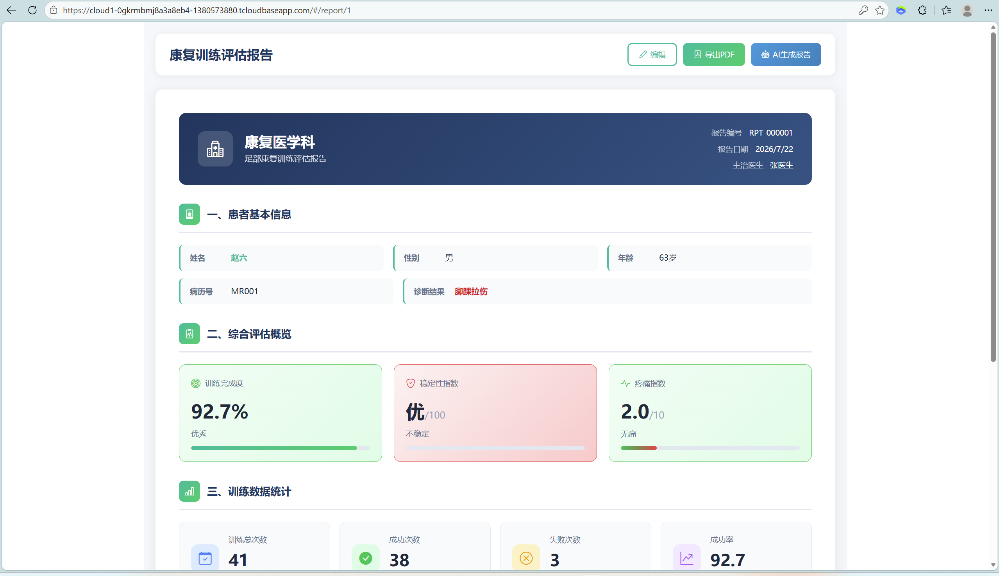

# 足部康复训练器 - 医生端数据管理平台

<div align="center">
  <!-- 📷 插图位置1: 项目Logo或Banner -->
  <!--  -->

  **基于 Vue 3 + Express + CloudBase 的康复数据管理系统**

  [](https://vuejs.org/)
  [](https://vitejs.dev/)
  [](https://expressjs.com/)
  [](LICENSE)

  **🔗 [在线演示](https://cloud1-0gkrmbmj8a3a8eb4-1380573880.tcloudbaseapp.com)** | **📖 [文档](#快速开始)**
</div>

---

## 📋 项目简介

本项目是一个专为康复科医生设计的**足部康复训练数据管理平台**，用于管理患者信息、追踪康复训练数据并调用DeepSeek API生成智能评估报告。


### 核心功能

- 🏥 **患者管理** - 添加、编辑、删除患者信息
- 📊 **数据追踪** - 记录训练次数、成功率、稳定性指数、疼痛指数
- 🤖 **AI智能报告** - 基于 DeepSeek API 自动生成康复评估报告
- 📄 **PDF导出** - 一键导出专业康复训练评估报告
- ☁️ **云端部署** - 支持腾讯云 CloudBase 一键部署





---

## 🛠️ 技术栈

| 层级 | 技术 | 版本 |
|------|------|------|
| 前端框架 | Vue 3 | ^3.4.0 |
| 构建工具 | Vite | ^5.4.19 |
| UI 框架 | Element Plus | ^2.10.3 |
| 路由 | Vue Router | ^4.3.0 |
| HTTP 客户端 | Axios | ^1.10.0 |
| 后端框架 | Express | ^4.18.2 |
| 数据库 | 腾讯云 CloudBase | - |
| AI 接口 | DeepSeek API | - |



---

## 🚀 快速开始

### 环境要求

| 工具 | 版本要求 |
|------|----------|
| Node.js | == 18.15.0 |
| npm | >= 8.0.0 |
| CloudBase CLI | == 3.0.1 |

### 安装步骤

#### 1. 克隆项目

```bash
git clone https://github.com/your-username/foot-rehabilitation-doctor-platform.git
cd foot-rehabilitation-doctor-platform
```

#### 2. 配置环境变量

复制环境变量示例文件并填入真实值：

```bash
# 根目录
cp .env.example .env

# 前端目录
cd web/web_doctor
cp .env.example .env
```

#### 3. 启动后端服务

```bash
cd server
npm install
node index.js
```

后端服务运行在 `http://localhost:3001`

#### 4. 启动前端开发服务器

```bash
cd web/web_doctor
npm install
npm run dev
```

前端访问地址：`http://localhost:5173`

## 📁 项目结构

```
.
├── server/                    # 后端服务
│   ├── index.js              # 主服务文件 (CloudBase)
│   ├── .env                  # 环境变量 
│   └── package.json
├── web/
│   └── web_doctor/           # 前端应用
│       ├── src/
│       │   ├── views/
│       │   │   ├── Report.vue    # AI报告页面
│       │   │   ├── Login.vue     # 登录页面
│       │   │   └── ...
│       │   └── api/              # API接口
│       ├── server.js         # 本地开发服务器
│       ├── index.cjs         # 备用服务器
│       ├── .env              # 环境变量 
│       └── package.json
├── .env.example              # 环境变量示例
├── .gitignore
└── README.md
```

---

## ☁️ 腾讯云部署

### 部署步骤

#### 1. 构建前端

```bash
cd web/web_doctor
npm run build
```

构建产物将输出到 `dist` 文件夹。

#### 2. 登录 CloudBase

```bash
tcb login
```

#### 3. 部署后端云函数

```bash
cd server
tcb fn deploy doctor -e <环境ID>
```

#### 4. 部署前端静态资源

```bash
cd web/web_doctor
tcb hosting deploy ./dist -e <环境ID>
```

部署成功后访问：**[https://cloud1-0gkrmbmj8a3a8eb4-1380573880.tcloudbaseapp.com](https://cloud1-0gkrmbmj8a3a8eb4-1380573880.tcloudbaseapp.com)**

---

## 🔐 环境变量说明

| 变量名 | 说明 | 所在文件 |
|--------|------|----------|
| `DB_USER` | 数据库用户名 | `.env` |
| `DB_PASSWORD` | 数据库密码 | `.env` |
| `DB_SERVER` | 数据库服务器 | `.env` |
| `DB_NAME` | 数据库名称 | `.env` |
| `CLOUDBASE_ENV_ID` | CloudBase 环境ID | `.env` |
| `CLOUDBASE_SECRET_ID` | CloudBase 密钥ID | `.env` |
| `CLOUDBASE_SECRET_KEY` | CloudBase 密钥 | `.env` |
| `VITE_DEEPSEEK_API_KEY` | DeepSeek API密钥 | `web/web_doctor/.env` |
| `VITE_DEEPSEEK_API_URL` | DeepSeek API地址 | `web/web_doctor/.env` |

---

## 📸 其余功能截图展示

<div align="center">
  
  
</div>

<div align="center">
  
</div>

---

## 🤝 贡献指南

1. Fork 本仓库
2. 创建你的特性分支 (`git checkout -b feature/AmazingFeature`)
3. 提交你的更改 (`git commit -m 'Add some AmazingFeature'`)
4. 推送到分支 (`git push origin feature/AmazingFeature`)
5. 打开一个 Pull Request

---

## 📄 许可证

本项目采用 MIT 许可证 - 查看 [LICENSE](LICENSE) 文件了解详情

---

<div align="center">
  <!-- 📷 插图位置10: 底部Banner或二维码 -->
  <!--  -->

  **如果这个项目对你有帮助，请给个 ⭐ Star 支持一下！**
</div>
